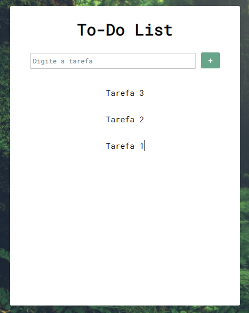
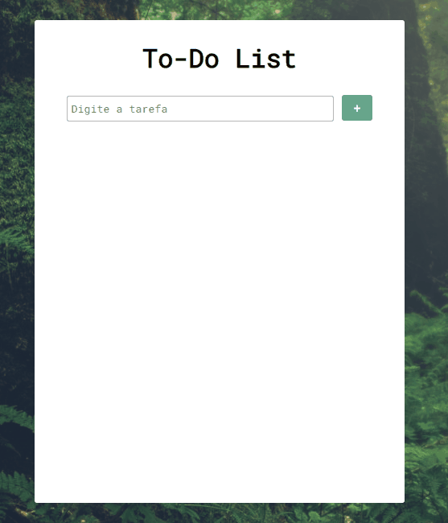

<h1 align="center">To-do List</h1>

<br>

<p>Em construção... 🚀</p>

<h2>Tecnologias utilizadas</h2>
<ul>
    <li>HTML ✅</li>
    <li>CSS ✅</li>
    <li>JavaScript ✅</li>
</ul>

<h2>Imagens do projeto</h2>



<h2>Pré-requisitos</h2>
<p>Antes de começar, você vai precisar ter instalado as seguintes ferramentas:</p>
<ul>
    <li><a href="https://nodejs.org/pt-br/download/" target="_blank">Node.js</li>
    <li><a href="https://gitforwindows.org/" target="_blank">Git</li>
</ul>

<h2>Clone este repositório</h2>

```bash
$ git clone https://github.com/victordunaivits/todo-list.git
```